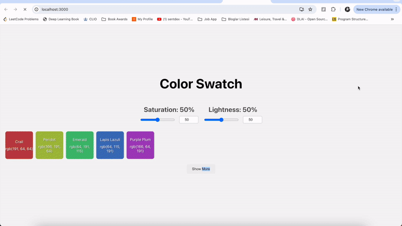

# Color Swatches - Akkio Frontend Technical Assessment

## Overview 
An example project that uses the [color api](https://www.thecolorapi.com/) to build a grid of Hue, Saturation, Lightness (HSL) color swatches by taking user inputs for Saturation (S) and Lightness (L).

## Demo



## Getting Started

To run this project locally, follow the steps below.

1. **Clone the repository.**

    ```
    git clone  https://github.com/k-erdem/color-swatches.git
    ```

2.  **Navigate** to the folder and then the server directory:

    ```
    cd color-swatches
    cd src
    ```
3. **Install** Node.js

 Go to the [official Node.js website](https://nodejs.org/) and download the installer.

4. **Install dependencies** in the project directory. Install the required dependencies by running:

    ```
    npm install
    ```
This command will install all the dependencies listed in the package.json file, including React and other necessary packages.

5. **Start** the development server

Once the dependencies are installed, you can start the development server by running:

    ```
    cd color-swatches
    cd src
    ```
The application should open automatically in your default web browser. If it doesn't, you can manually open http://localhost:3000 in your browser.

6. View the application

You should now see the Color Swatch application running in your browser. You can interact with the color controls to see different color swatches.

7. Stop the server

When you're done, you can stop the development server by pressing Ctrl + C in the terminal where the server is running.


## Considerations & Design Choices

I focused extensively on user experience and technical optimization for the Color Swatch assessment. The design is responsive, serving all desktop, tablet, and mobile users. User interaction is intuitive thanks to dual-input controls. Users can type Saturation and Lightness values manually (so they can look up specific outcomes they're curious about), or use the slider to experiment with different range values of S,L variables. To enhance performance and user feedback, the application employs debouncing techniques (which prevents rapid successive API calls during user input), skeleton loading states (for providing feedback to users when swatches are loading), loading indicator in the form of a message and a cute theme-relevant gif to make sure users know what's happening behind their screens and they know to wait as the app loads. I also used debouncing to prevent excessive API calls during rapid user input.

API calls were made if S,L values were manipulated. However to ensure fast response, I choose to only render a subset of 5 swatches for immediate feedback. Meanwhile, the rest of the swatches were rendered on the background and made visible only after users clicked the "See More" button. This tiered rendering approach, along with clear loading indicators and error handling, helped ensure a smooth and informative user experience. The core challenge of efficiently determining distinct color names while minimizing API calls was addressed through an innovative binary search algorithm. Binary Search was made possible, since as the assessment specs mention, color names always progress in one direction as the hue changes and can never appear again after the name changes (ie. they're ordered by name). Using Binary Search in optimization, alongside local storage caching, significantly reduced the number of API requests. 

I hope you enjoyed reading about my design choices. I'm looking forward to hearing your feedback! :)
